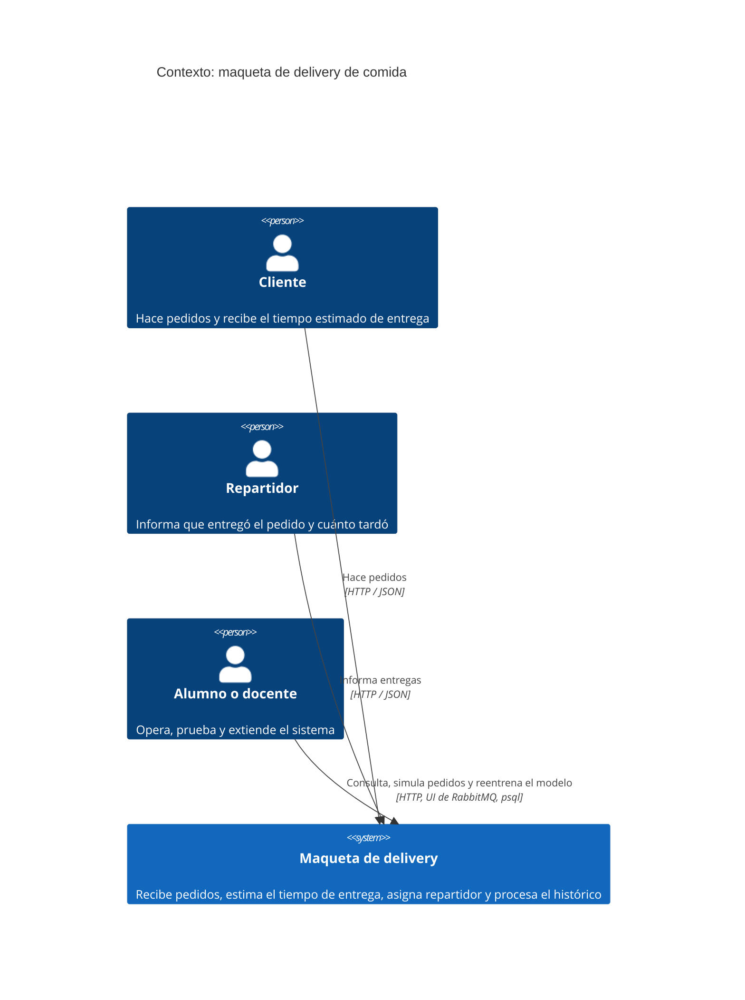
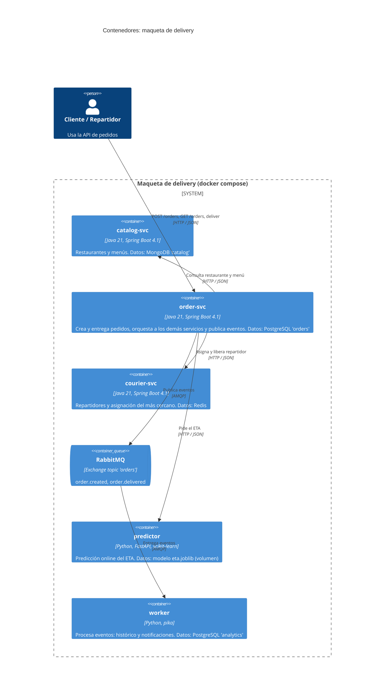
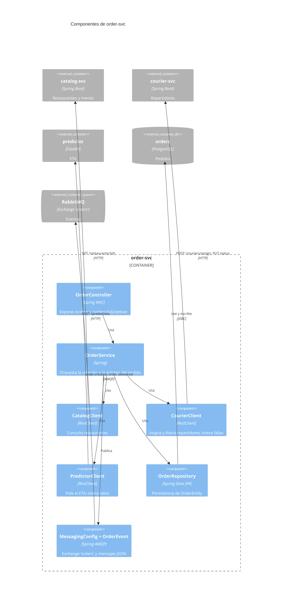

# Arquitectura (modelo C4)

Diagramas en [Mermaid C4](https://mermaid.js.org/syntax/c4.html), de lo general a lo particular:
contexto, contenedores y componentes de `order-svc`.

## Nivel 1: contexto

## Nivel 2: contenedores

Datos de cada contenedor (una base por servicio, RNF-02):

| Contenedor | Almacén | Qué guarda |
|---|---|---|
| order-svc | PostgreSQL, base `orders` | Pedidos |
| catalog-svc | MongoDB, base `catalog` | Restaurantes con el menú embebido |
| courier-svc | Redis | Un hash por repartidor y el set de los libres |
| predictor | Archivo `models/eta.joblib` (volumen) | Modelo entrenado, con versión y MAE |
| worker | PostgreSQL, base `analytics` | Tabla `orders_history` |

Notas:

- `orders` y `analytics` comparten la instancia de PostgreSQL pero son bases distintas, y ningún
  servicio usa la del otro.
- **Sincrónico donde se necesita la respuesta** (catálogo, repartidor, ETA); **asincrónico para
  lo que puede esperar** (histórico y notificaciones), de modo que el worker no frena al cliente.
- `order-svc` es el único que habla con los otros servicios: catalog, courier y predictor no se
  conocen entre sí.

### Puertos y accesos

| Contenedor | Puerto | Para qué |
|---|---|---|
| order-svc | 8082 | API de pedidos |
| catalog-svc | 8081 | API de catálogo |
| courier-svc | 8083 | API de repartidores |
| predictor | 8000 | API del modelo (`/docs` muestra Swagger) |
| RabbitMQ | 5672 / 15672 | AMQP / interfaz web (guest/guest) |
| PostgreSQL | 5432 | usuario `ahk`, bases `orders` y `analytics` |
| MongoDB | 27017 | base `catalog` |
| Redis | 6379 | |

## Nivel 3: componentes de order-svc

## Decisiones de diseño

| Decisión | Motivo |
|---|---|
| Tres tecnologías de base de datos (PostgreSQL, MongoDB, Redis) | Cada una encaja con su dato (pedidos relacionales, menú como documento, disponibilidad efímera) y los alumnos ven los tres modelos. |
| Controllers explícitos (`@RestController`), sin Spring Data REST | La API es un contrato deliberado, no un espejo de las tablas. |
| Predictor y worker en Python | Es donde trabajan los alumnos de ciencia de datos; los de sistemas se concentran en los tres servicios Java. |
| Evento en lugar de llamada directa al worker | El histórico y las notificaciones no deben demorar ni hacer fallar la creación del pedido. |
| Fallas de predictor y repartidor toleradas | El pedido es lo importante; el ETA y el repartidor son mejoras que pueden faltar (RS-02, RS-03). |
| Una imagen por servicio, compose sin `build` | Los alumnos levantan el sistema sin compilar; el laboratorio no tiene internet. |
