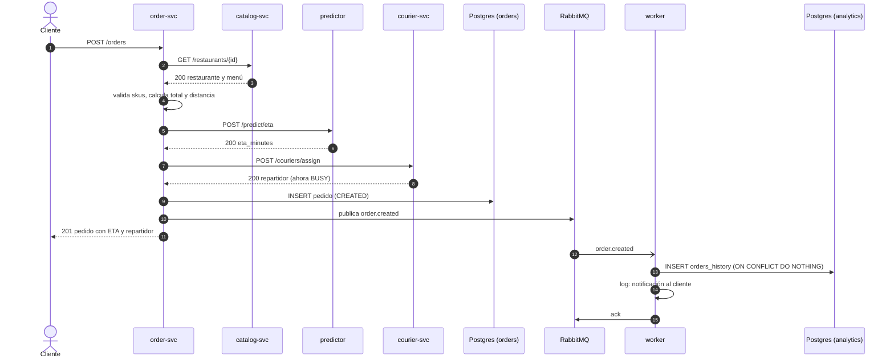
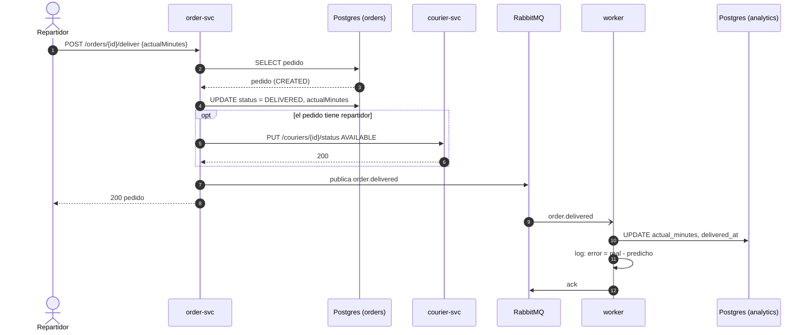
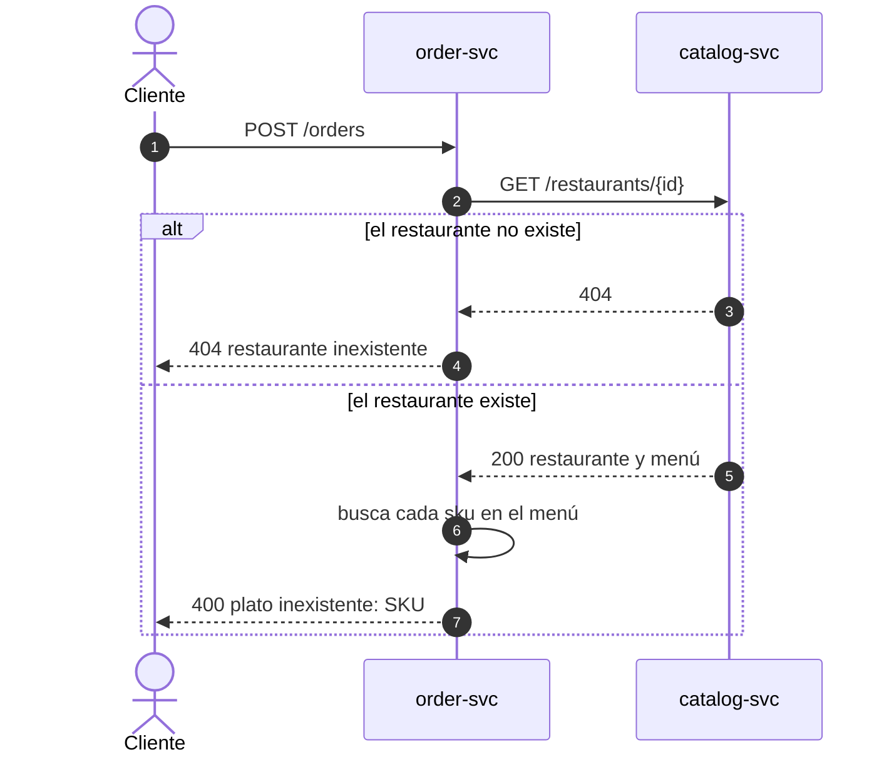
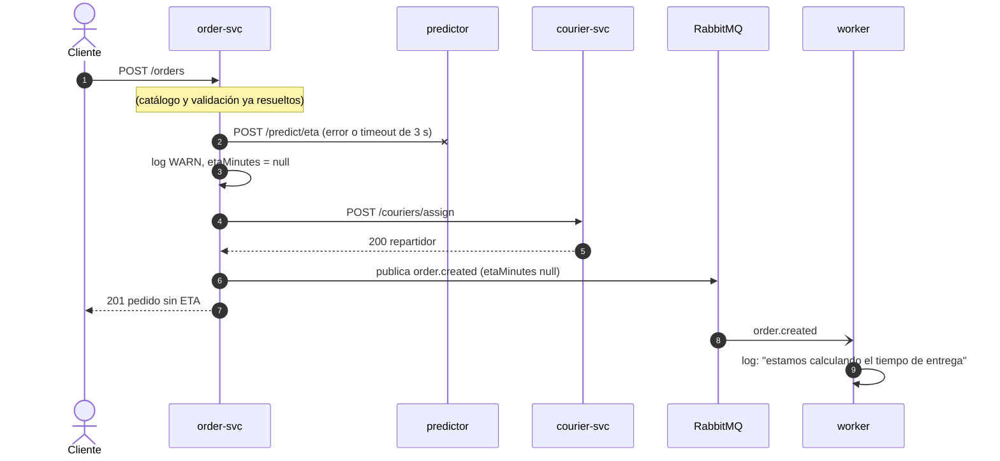
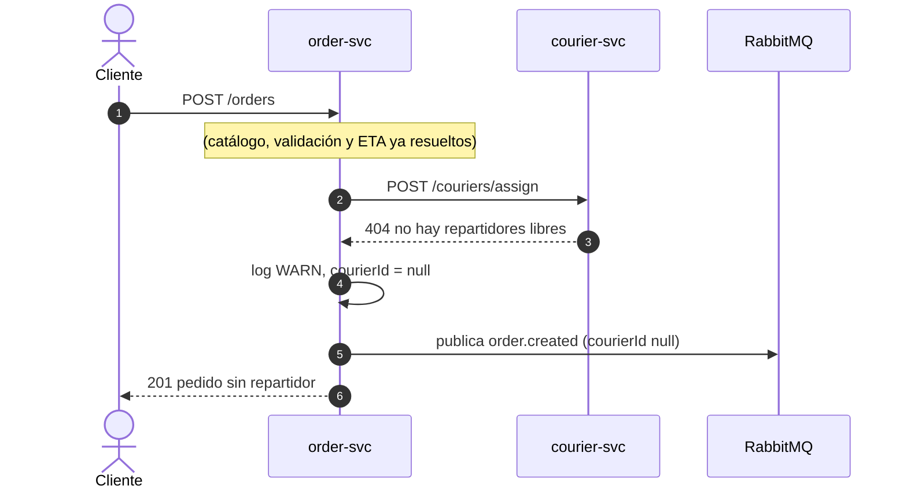
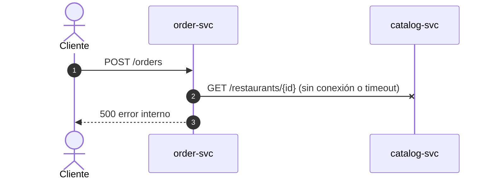
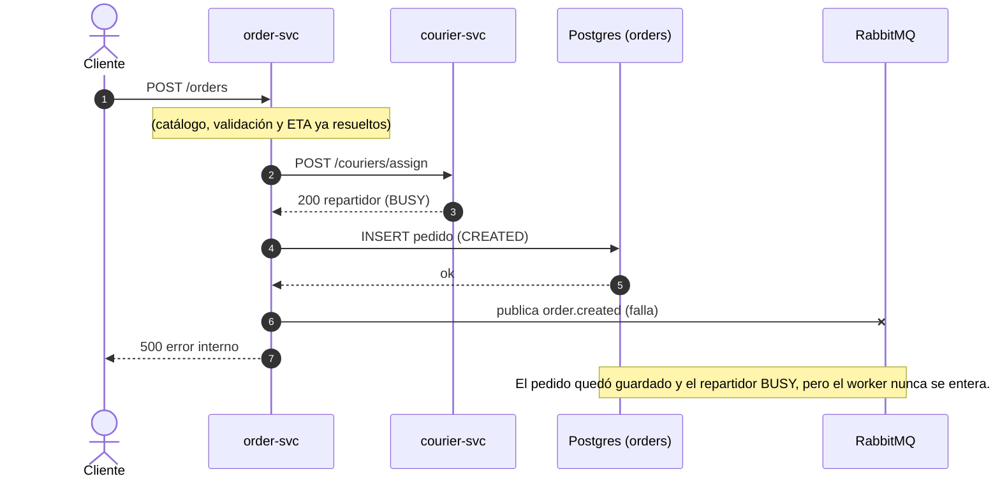
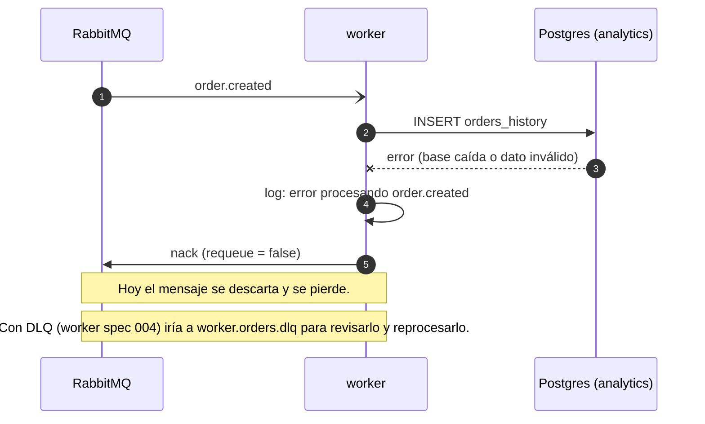
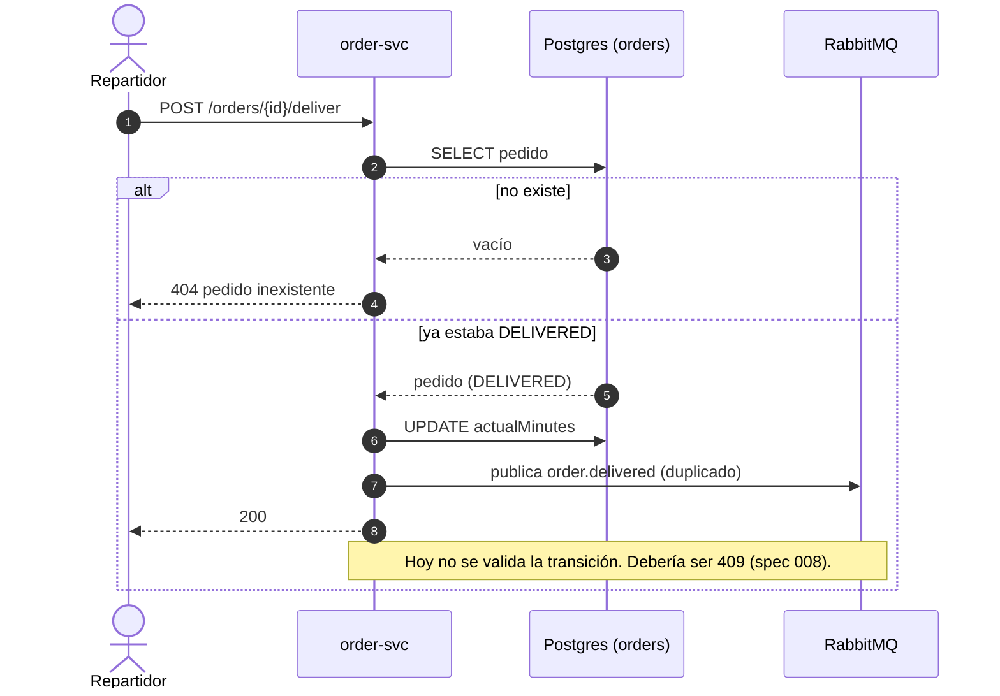

# Requisitos del sistema

Requisitos que **cruzan varios servicios**. Cada servicio detalla su parte en sus propios `specs/`
(ver la matriz de trazabilidad al final). Si un cambio toca un contrato entre servicios, se
actualiza primero este documento.

Convenciones: **RS-xx** = requisito funcional del sistema, **RNF-xx** = no funcional.
*Implementado* describe lo que hace hoy el sistema; *Propuesto* es una tarea para los alumnos.

## 1. Requisitos funcionales

| ID | Requisito | Servicios | Estado |
|---|---|---|---|
| RS-01 | El cliente puede crear un pedido de uno o más platos de un restaurante y consultarlo después. | order, catalog | Implementado |
| RS-02 | Al crear el pedido se estima el tiempo de entrega (ETA) con un modelo online. Si el predictor falla, el pedido se crea igual, sin ETA. | order, predictor | Implementado (ETA de reserva: propuesto) |
| RS-03 | Al crear el pedido se asigna el repartidor libre más cercano al restaurante. Si no hay ninguno, el pedido se crea igual, sin repartidor. | order, courier | Implementado |
| RS-04 | Un pedido inválido (restaurante o plato inexistente) se rechaza sin efectos secundarios. | order, catalog | Parcial: faltan validaciones |
| RS-05 | Cada cambio relevante de un pedido se publica como evento, sin que `order-svc` espere a quien lo consume. | order, worker | Implementado |
| RS-06 | Todo pedido queda registrado en un histórico de analítica, de forma idempotente. | worker | Implementado |
| RS-07 | Informar la entrega cierra el pedido y libera al repartidor. | order, courier | Implementado |
| RS-08 | Se puede medir la calidad de la predicción: error entre ETA y tiempo real. | order, worker | Implementado (reporte y alertas: propuesto) |
| RS-09 | Una falla de una dependencia o de un mensaje no tumba el sistema ni corrompe datos. | todos | Parcial (ver casos de error) |
| RS-10 | Al levantar el sistema por primera vez hay datos de ejemplo y todo arranca en orden. | todos | Implementado |
| RS-11 | Un pedido tiene un ciclo de vida definido (`CREATED`, `DELIVERED`, `CANCELLED`) con transiciones válidas. | order | Parcial: sin validar transiciones; sin cancelar |
| RS-12 | El modelo de predicción se puede reentrenar, versionar y ampliar con nuevos predictores. | predictor, worker | Parcial: entrenamiento sintético |

## 2. Requisitos no funcionales

| ID | Requisito |
|---|---|
| RNF-01 | Un solo comando (`docker compose up -d`, desde `ahk-delivery-infra/`) levanta todo el sistema a partir de imágenes. |
| RNF-02 | Cada servicio es dueño de su base y ningún otro servicio accede a ella: catalog→MongoDB, order→PostgreSQL (`orders`), courier→Redis, worker→PostgreSQL (`analytics`). |
| RNF-03 | La comunicación sincrónica es REST/JSON; la asincrónica son eventos JSON en RabbitMQ. Los contratos están en los `specs/` del servicio que los publica. |
| RNF-04 | Las llamadas entre servicios tienen timeout (2 s de conexión y 3 s de lectura) para que una dependencia lenta no cuelgue al resto. |
| RNF-05 | El sistema funciona sin internet una vez que las imágenes están en la máquina (laboratorio de las VMs). |
| RNF-06 | Cada servicio pasa sus chequeos de calidad (formato y análisis estático) antes de entregar cambios. |

## 3. Quién es dueño de qué

| Dato | Dueño | Lo consumen |
|---|---|---|
| Restaurantes y menús | catalog-svc | order-svc (consulta REST) |
| Estado y datos del pedido | order-svc | worker (eventos) |
| Repartidores y disponibilidad | courier-svc | order-svc (REST) |
| Modelo de ETA | predictor | order-svc (REST) |
| Histórico de analítica | worker | predictor, al reentrenar (propuesto) |

El **estado del pedido** (`CREATED`, `DELIVERED`, ...) lo define y valida `order-svc`; su diagrama de
estados está en el [spec 000 de order-svc](https://github.com/ezequieljsosa/ahk-delivery-order-svc/blob/main/specs/000-ciclo-de-vida-del-pedido/spec.md). Este documento solo muestra
cómo reaccionan los demás servicios a cada cambio de estado.

## 4. Flujos

Los diagramas de secuencia describen el comportamiento **actual**. Donde hoy hay una limitación,
se marca con una nota y se indica la feature propuesta que la resuelve.

### 4.1 Pedido exitoso (RS-01, RS-02, RS-03, RS-05, RS-06)

### 4.2 Entrega exitosa (RS-07, RS-08)

### 4.3 Error: restaurante o plato inexistente (RS-04)

No se guarda nada, no se llama al predictor ni al repartidor, y no se publica ningún evento.

### 4.4 Degradación: predictor caído o lento (RS-02)

> Mejora propuesta: ETA de reserva (`order-svc` spec 005).

### 4.5 Degradación: sin repartidores libres (RS-03)

> El pedido queda sin repartidor y hoy nadie lo reasigna después.

### 4.6 Error: catalog-svc caído (RS-09)

> Hoy responde 500 y no hay efectos secundarios. Debería ser 503 (`order-svc` spec 007).

### 4.7 Error: RabbitMQ caído al crear el pedido (RS-09)

> Inconsistencia conocida. La resuelve el patrón *outbox* (`order-svc` spec 009).

### 4.8 Error: el worker no puede procesar un mensaje (RS-09)

### 4.9 Error: entregar un pedido inexistente o ya entregado (RS-07, RS-11)

## 5. Estados del pedido

El diagrama de estados completo y la tabla de transiciones viven en el servicio dueño de la entidad:
[`specs/000-ciclo-de-vida-del-pedido/spec.md` en ahk-delivery-order-svc](https://github.com/ezequieljsosa/ahk-delivery-order-svc/blob/main/specs/000-ciclo-de-vida-del-pedido/spec.md).
Resumen de cómo reaccionan los demás servicios:

| Estado | Lo provoca | courier-svc | worker |
|---|---|---|---|
| `CREATED` | `POST /orders` | el repartidor pasa a `BUSY` | inserta el pedido en `orders_history` |
| `DELIVERED` | `POST /orders/{id}/deliver` | el repartidor vuelve a `AVAILABLE` | completa `actual_minutes` y registra el error |
| `CANCELLED` *(propuesto)* | cancelar | el repartidor vuelve a `AVAILABLE` | marca el pedido como cancelado |

## 6. Trazabilidad: requisito → specs

| Requisito | [catalog-svc](https://github.com/ezequieljsosa/ahk-delivery-catalog-svc/tree/main/specs) | [order-svc](https://github.com/ezequieljsosa/ahk-delivery-order-svc/tree/main/specs) | [courier-svc](https://github.com/ezequieljsosa/ahk-delivery-courier-svc/tree/main/specs) | [predictor](https://github.com/ezequieljsosa/ahk-delivery-predictor/tree/main/specs) | [worker](https://github.com/ezequieljsosa/ahk-delivery-worker/tree/main/specs) |
|---|---|---|---|---|---|
| RS-01 | 001 | 001, 002 | | | |
| RS-02 | | 001, 005 | | 001 | |
| RS-03 | | 001 | 001, 002, 004, 005, 006 | | |
| RS-04 | 001, 004, 005 | 001, 007 | | | |
| RS-05 | | 001, 004 | | | 001 |
| RS-06 | | 004 | | | 001, 002 |
| RS-07 | | 003 | 003 | | |
| RS-08 | | 003 | | | 002, 005, 006 |
| RS-09 | | 009 | 006 | | 003, 004 |
| RS-10 | 002, 003 | | 001 | | 003 |
| RS-11 | | 000, 006, 008 | | | |
| RS-12 | | | | 002, 003, 004, 005, 006 | |
